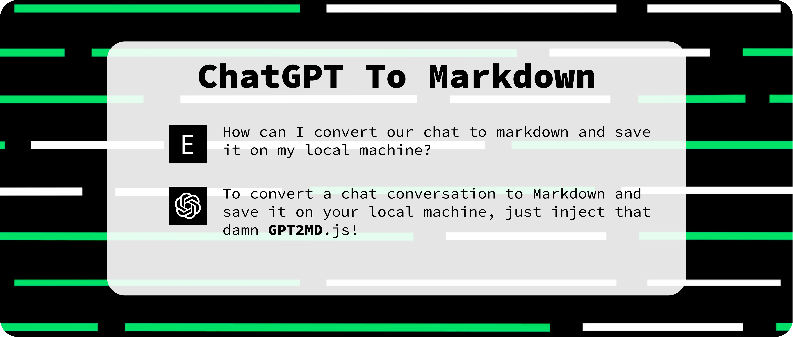

# OpenAI chat (ChatGPT) to Markdown or TXT



### GPT2MD is a neat way to convert your chats with OpenAI - ChatGPT to Markdown. Just inject GPT2MD.js and then call the `SaveChatGPTtoMD` function.

You can use some third parties like <a href="https://chrome.google.com/webstore/detail/scripty-javascript-inject/milkbiaeapddfnpenedfgbfdacpbcbam"><b> Scripty</b></a> to inject a JS script to your DOM.

Also, a fascinating idea is setting an onkeypress event handler directly on the window object so that when particular key combinations are pressed, the function is called.
```js
window.onkeypress = function(event) {
	if (event.keyCode == 68) { // keyCode 68 stands for ctrl+D
		SaveChatGPTtoMD();
	}
}
```

Method No. 2: Using event listeners
```js
window.addEventListener('keypress', function(event) {
	if (event.keyCode == 69) { // keyCode 69 stands for ctrl+E
		SaveChatGPTtoTXT();
	}
});
```

<br>

You can also change the code to simultaneously change the ready-to-download variable and, using desired key combinations, save the output file as either TXT or MD.

It would be nice to add a lightweight browser extension to make it easier for you to use this tool and easily convert your chat history with ChatGPT into your preferred outputs (TXT, MD, PDF, etc.) ASAP.
